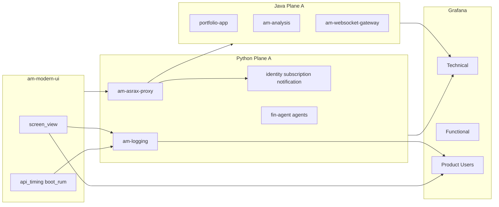

# Path to 10/10 — Java + Flutter + Python (reviewed)

> Canonical plan copy for slowness diagnosis + product/user dashboards.  
> Saved: 2026-07-17 · Out of scope: **am-auth** · Tracing sampling: **central in am-env-vault** · Feature branches: create later.

## Scope changes (this revision)

| Change | Decision |
|--------|----------|
| **am-auth** | **OUT of scope** (entire repo — no login counters, no Plane A work in this plan) |
| **am-env-vault** | **IN scope** — **central** `TRACING_SAMPLING_PROBABILITY` (prefer vault over per-service helm) |
| **Python repos** | **IN scope** — Plane A for all deployable Python services; domain KPIs where natural |
| **Feature branches** | **Later** — create with meaningful names (convention below); not created yet |

### Tracing sampling policy (vault-owned)

Prefer **one vault-controlled value** (env/cluster or shared secret key) over per-service helm `TRACING_SAMPLING_PROBABILITY`.

| Environment | Vault path | Value | Notes |
|-------------|------------|-------|--------|
| **dev** | `apps/data/dev/infra/observability` | `1.0` | Validate Tempo |
| **preprod** | `apps/data/preprod/infra/observability` | `1.0` | Validate Tempo |
| **prod** | `apps/data/prod/infra/observability` | `0.1` | Steady |
| Explicitly off | same paths | `0.0` | Only when intentional |

**Rule:** Do not fight vault with per-service helm overrides. Helm may omit sampling or document “injected from vault.” Plane A still wires OTEL exporter; **rate comes from vault**.

---

## Repos that need changes

### Must change

| Repo | Stack | Phase | What changes |
|------|-------|-------|--------------|
| **am-core-services** | Java | P1, P3 | JWT→MDC in obs/security lib; optional gateway telemetry ingest; publish lib |
| **am-portfolio** | Java | P1, P3 | Lib bump; domain meters |
| **am-market** | Java + Python | P1–P3 | Java market-data Plane A/domain; **am-parser** Python Plane A |
| **am-trade-management** | Java | P1, P3 | Lib bump; TradeBusinessMetrics |
| **am-doc-intelligence** | Java + Python | P1–P3 | document-processor + cloudinary; **am-email-extractor** Python Plane A |
| **am-observability** | Python tooling | P1–P3 | Product/Users dashboard; Loki panels; domain hide-no-data; `tier-b-python` / Python signals; tag release |
| **am-infra** | K8s | P1–P3 | obs-upgrade; Traefik/nginx scrape for modern-ui |
| **am-env-vault** | Vault/env | P1 | Central `TRACING_SAMPLING_PROBABILITY` (not per-service helm); set intentional rate per env |
| **am-modern-ui** | Flutter | P2–P3 | screen_view, api_timing, boot_rum, feature_action, sink |
| **am-logging** | Python | P1–P2 | Plane A `/metrics` + scrape; **telemetry ingest** for Flutter events → Loki |
| **am-asrax-proxy** | Python | P1–P2 | Plane A (edge gateway — high priority for slowness) |
| **am-platform** | Python | P1–P3 | Plane A for **am-identity**, **am-subscription**, **am-notification** |
| **am-fin-agent** | Python | P1–P2 | Plane A |
| **am-agents** | Python | P1–P3 | Plane A for ui-test-agent, tool-agent, db-agent; optional domain (LLM/tool calls) |

### Explicitly OUT of scope

| Repo | Why |
|------|-----|
| **am-auth** | User removed — no Plane A / no login product KPIs in this plan |
| amctl, am-scripts, am_portfolio_client, am-common-data, am-pipelines | No deployable apps on this path (pipelines = chart only) |

### Optional

| Repo | When |
|------|------|
| VPS / VPS-Infra | Only if Traefik scrape is owned outside am-infra |

---

## Python fleet review (added to plan)

**Today:** 0 deployable Python apps have Prometheus `/metrics`, scrape annotations, OTEL sampling, `application` label, or `observability.yaml`. Universal-chart supports `podAnnotations` but Python values never set them.

| Service | Repo | App name today | Priority for slowness/UI |
|---------|------|----------------|--------------------------|
| am-logging-svc | am-logging | `am-logging` | P1 — telemetry sink + own Plane A |
| am-asrax-proxy | am-asrax-proxy | image `am-asrax-proxy` | **P1** — edge latency for “website slow” |
| am-identity | am-platform | `am-identity` | P1 — JWT issuer path |
| am-subscription | am-platform | `am-subscription` | P2 |
| am-notification | am-platform | `am-notification` | P2 |
| am-fin-agent | am-fin-agent | `am-fin-agent` | P2 — AI section |
| am-ui-test-agent | am-agents | `am-ui-test-agent` | P2 |
| am-tool-agent | am-agents | `am-tool-agent` | P2 (Langfuse ≠ Plane A OTLP) |
| am-db-agent | am-agents | `am-db-agent` | P2 |
| am-parser | am-market | `am-parser` | P2 |
| am-email-extractor | am-doc-intelligence | `am-email-extractor` | P2 |

**Python Plane A checklist (per service):**
1. Expose `/metrics` (e.g. `prometheus-fastapi-instrumentator` or `prometheus_client`)
2. Common label `application=<service-name>` on all metrics
3. Helm `podAnnotations`: `prometheus.io/scrape`, `port`, `path`
4. OTEL OTLP traces → `otel-collector`; **sampling rate from am-env-vault** (`TRACING_SAMPLING_PROBABILITY`), not per-service helm
5. `observability.yaml` with `runtime: python`, bundle `tier-b-python` (or tier-a equivalent when RED metrics exist)
6. Optional domain counters (proxy requests, agent tool invocations, notifications sent)

**Grafana note:** Technical dropdown today uses `jvm_memory_used_bytes` for Service discovery — **Python will not appear** until discovery query is broadened (e.g. `up` / `http_requests_total` / `process_resident_memory_bytes`). That change lands in **am-observability** + **am-infra**.

---

## Feature branch naming (create later — do not create now)

Pattern: `feature/obs-<track>-<short-goal>`

| Repo | Branch name (when ready) |
|------|--------------------------|
| am-core-services | `feature/obs-jwt-mdc-user-attribution` |
| am-portfolio | `feature/obs-plane-a-domain-kpis` |
| am-market | `feature/obs-plane-a-domain-kpis` |
| am-trade-management | `feature/obs-plane-a-domain-kpis` |
| am-doc-intelligence | `feature/obs-plane-a-domain-kpis` |
| am-observability | `feature/obs-product-users-dashboard` |
| am-infra | `feature/obs-product-dashboard-and-edge-scrape` |
| am-modern-ui | `feature/obs-product-telemetry-rum` |
| am-logging | `feature/obs-plane-a-and-telemetry-ingest` |
| am-asrax-proxy | `feature/obs-plane-a-prometheus-otel` |
| am-platform | `feature/obs-plane-a-identity-subscription-notification` |
| am-fin-agent | `feature/obs-plane-a-prometheus-otel` |
| am-agents | `feature/obs-plane-a-prometheus-otel` |
| am-env-vault | `feature/obs-central-tracing-sampling` |

Rules: branch from `main`/`master`; one concern per branch; PR title matches branch intent.

---

## Scorecard — today vs 10/10 (re-reviewed with Python)

| Goal | Today | 10/10 | Closes gap |
|------|-------|-------|------------|
| Which API is slow? (Java) | **8** | **10** | Plane A complete + Slow API |
| Which API is slow? (Python / edge) | **1** | **10** | Python `/metrics` + asrax-proxy + Service discovery not JVM-only |
| Why slow (Tempo)? | **7** | **10** | OTEL on Java+Python; **central vault sampling** (not per-service) |
| Client/website slow? | **2** | **10** | Flutter RUM + Traefik TTFB |
| Sections liked? | **3** | **10** | Flutter screen_view |
| DAU / prime user? | **2** | **10** | JWT→MDC + Product dashboard (no am-auth login KPIs) |
| Domain clarity | **4** | **10** | Hide no-data tiles |
| Python services in Grafana | **0** | **10** | Plane A + non-JVM discovery |
| **Overall** | **~5–6** | **10** | Java + Flutter + Python tracks |

---

## Gap inventory (updated)

### G1 — Attribution
- [ ] JWT→MDC on Java UI backends (not via am-env-vault)
- [ ] Flutter anon/session ids
- [ ] Python request logs with user id where JWT is validated (asrax-proxy / identity consumers)

### G2 — Slowness backends
- [ ] Java Plane A complete
- [ ] **Python Plane A** for all services in table above
- [ ] **Widen Grafana Service discovery** beyond `jvm_memory_used_bytes`
- [ ] Loki duration panels
- [ ] **am-env-vault:** central `TRACING_SAMPLING_PROBABILITY` (prefer over per-service helm); set `1.0` while validating Tempo, then `0.1` steady — avoid accidental `0.0`

### G3 — Client / edge
- [ ] Flutter api_timing + boot_rum
- [ ] Traefik/nginx scrape (am-infra)
- [ ] asrax-proxy latency metrics (Python Plane A)

### G4 — Product
- [ ] screen_view / feature_action / Product dashboard
- [ ] DAU from Loki/Flutter
- [ ] ~~am-auth login counters~~ **OUT OF SCOPE**

### G5–G8
- Funnels, prime users, domain hide-no-data, Java+Python domain KPIs, privacy gating — unchanged intent; auth removed from G4

---

## Architecture (Java + Python + Flutter)

---

## Phased path

### Phase 1 — Java attribution + obs catalog + Python Plane A kickoff
1. am-core-services: JWT→MDC; publish lib
2. Bump Java consumers
3. **am-env-vault:** central tracing sampling (not per-service helm); set intentional rate per env
4. am-observability: Loki duration/DAU; start non-JVM Service variable; Product skeleton
5. Start Python Plane A on **am-logging** + **am-asrax-proxy** (highest leverage)
6. am-infra apply when tagged

### Phase 2 — Flutter product + remaining Python Plane A
1. am-logging telemetry ingest
2. am-modern-ui events
3. Plane A for am-platform, am-fin-agent, am-agents, am-parser, am-email-extractor
4. Product/Users dashboard live

### Phase 3 — Domain KPIs + polish
1. Java domain meters (portfolio/market/trade/docs)
2. Python domain where useful (proxy RPS, agent tool calls, notifications)
3. Traefik edge panels; funnels; feature_action; hide domain zeros
4. **No am-auth work** (vault sampling already done in P1)

**10/10 acceptance (updated):**
- [ ] Slow API diagnosable for Java **and** key Python (proxy, identity, logging)
- [ ] Python services appear in Grafana Service dropdown (non-JVM discovery)
- [ ] Client vs server vs edge slowness separable
- [ ] Top sections by screen_view; DAU without am-auth
- [ ] Domain tiles not fake-zero for wrong service
- [ ] Product board ≠ Technical board
- [ ] Tracing sample rate owned in **am-env-vault** (not scattered per-service helm)

---

## Metric checklist (delta)

| ID | Metric | Phase | Notes |
|----|--------|-------|-------|
| A1–A5 | Java Slow API / Tempo / WS | Have / P1 | Sampling via vault |
| A6–A9 | Client RUM + edge | P2–P3 | |
| A10 | Central `TRACING_SAMPLING_PROBABILITY` | P1 | **am-env-vault** — not per-service helm |
| A11 | **Python HTTP latency** (asrax-proxy, identity, …) | P1–P2 | **NEW** |
| A12 | Non-JVM Service discovery | P1 | **NEW** — am-observability |
| B5 | Logins/day | — | **REMOVED** (am-auth out) |
| B11 | Python domain KPIs | P3 | **NEW** |

---

## Dependency order

1. am-core-services (JWT MDC) → Java bumps
2. **am-env-vault** (central tracing sampling) — early, so Tempo works while validating
3. am-observability (discovery + Product + Loki) → am-infra
4. am-logging Plane A + ingest
5. am-asrax-proxy Plane A
6. am-modern-ui emitters
7. Remaining Python Plane A (platform, agents, fin-agent, parser, email-extractor)
8. Domain KPIs Java + Python

**Later:** create feature branches using names in the table above.

---

## Rules

- No am-auth changes in this plan
- **Tracing sample rate lives in am-env-vault**, not per-service helm (avoid drift / accidental `0.0`)
- No `user_id` Prometheus labels
- Python uses `application=` label same as Java for Grafana
- Langfuse (agents) is not a substitute for OTLP Plane A
- First-party Loki only for product MVP

---

## Related docs

- [ONBOARDING.md](ONBOARDING.md) — service contracts
- [OPS_RELEASE.md](OPS_RELEASE.md) — tag + am-infra apply
- [debugging-signal-checklist.md](ops/debugging-signal-checklist.md) — signal debugging
